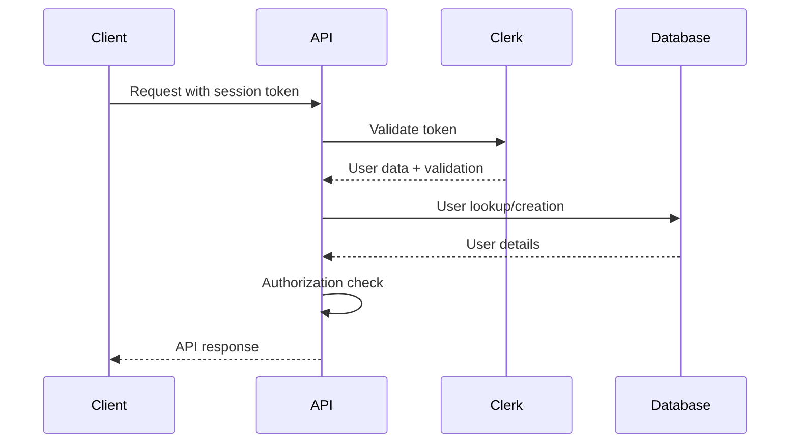

# API Design & Architecture

The BrainiX platform implements a comprehensive RESTful API architecture using Next.js API routes. This document details the API design patterns, endpoint structure, and implementation strategies used throughout the platform.

## 🎯 API Design Principles

### 1. **RESTful Architecture**
- Resource-based URLs with clear hierarchies
- HTTP methods mapping to CRUD operations
- Stateless request/response pattern
- Consistent response formats

### 2. **Security First**
- Authentication required for protected endpoints
- Role-based authorization
- Input validation and sanitization
- Rate limiting and abuse prevention

### 3. **Developer Experience**
- Consistent error handling
- Comprehensive documentation
- Type-safe implementations
- Predictable response structures

### 4. **Performance Optimization**
- Strategic caching headers
- Pagination for large datasets
- Efficient database queries
- Response compression

## 🔧 API Structure Overview

```
/api/
├── auth/                    # Authentication & authorization
├── users/                   # User management
├── courses/                 # Course operations
├── instructor/              # Instructor-specific endpoints
├── enrollments/             # Course enrollments
├── payments/                # Payment processing
├── cart/                    # Shopping cart operations
├── wishlist/                # Wishlist management
├── analytics/               # Analytics and reporting
├── admin/                   # Administrative functions
└── webhooks/                # External service webhooks
```

## 🔐 Authentication & Authorization

### Authentication Flow



### Authentication Implementation

```typescript
// Authentication middleware
import { auth } from '@clerk/nextjs/server';
import { NextRequest, NextResponse } from 'next/server';

export async function authenticateRequest(request: NextRequest) {
  try {
    const { userId } = await auth();
    
    if (!userId) {
      return NextResponse.json(
        { error: 'Authentication required' },
        { status: 401 }
      );
    }

    // Get user details from database
    const user = await prisma.user.findUnique({
      where: { clerkId: userId },
      include: {
        instructorProfile: true,
        studentProfile: true
      }
    });

    if (!user) {
      return NextResponse.json(
        { error: 'User not found' },
        { status: 404 }
      );
    }

    return { user, userId };
  } catch (error) {
    return NextResponse.json(
      { error: 'Authentication failed' },
      { status: 401 }
    );
  }
}

// Authorization helper
export function requireRole(allowedRoles: UserRole[]) {
  return (user: User) => {
    if (!allowedRoles.includes(user.role)) {
      throw new Error('Insufficient permissions');
    }
  };
}
```

## 📚 Core API Endpoints

### User Management APIs

#### Get User Profile
<div className="api-endpoint">
<span className="api-method api-method--get">GET</span>
<code>/api/users/profile</code>
</div>

Retrieves the authenticated user's profile information.

```typescript
// GET /api/users/profile
export async function GET(request: NextRequest) {
  const auth = await authenticateRequest(request);
  if (auth instanceof NextResponse) return auth;
  
  const { user } = auth;

  return NextResponse.json({
    id: user.id,
    email: user.email,
    name: user.name,
    role: user.role,
    avatar: user.avatar,
    profile: user.role === 'INSTRUCTOR' 
      ? user.instructorProfile 
      : user.studentProfile,
    createdAt: user.createdAt
  });
}
```

**Response:**
```json
{
  "id": "user_123",
  "email": "john@example.com",
  "name": "John Doe",
  "role": "STUDENT",
  "avatar": "https://example.com/avatar.jpg",
  "profile": {
    "learningGoals": ["web-development", "javascript"],
    "coursesCompleted": 5,
    "totalPoints": 1250
  },
  "createdAt": "2024-01-15T10:30:00Z"
}
```

#### Update User Profile
<div className="api-endpoint">
<span className="api-method api-method--put">PUT</span>
<code>/api/users/profile</code>
</div>

```typescript
// PUT /api/users/profile
const updateProfileSchema = z.object({
  name: z.string().min(1).max(100),
  bio: z.string().max(500).optional(),
  website: z.string().url().optional(),
  avatar: z.string().url().optional()
});

export async function PUT(request: NextRequest) {
  const auth = await authenticateRequest(request);
  if (auth instanceof NextResponse) return auth;
  
  const { user } = auth;
  const body = await request.json();
  
  try {
    const validatedData = updateProfileSchema.parse(body);
    
    const updatedUser = await prisma.user.update({
      where: { id: user.id },
      data: validatedData
    });

    return NextResponse.json({
      success: true,
      user: updatedUser
    });
  } catch (error) {
    if (error instanceof z.ZodError) {
      return NextResponse.json(
        { error: 'Validation failed', details: error.errors },
        { status: 400 }
      );
    }
    
    return NextResponse.json(
      { error: 'Failed to update profile' },
      { status: 500 }
    );
  }
}
```

### Course Management APIs

#### List Courses
<div className="api-endpoint">
<span className="api-method api-method--get">GET</span>
<code>/api/courses</code>
</div>

Public endpoint for browsing available courses with filtering and pagination.

```typescript
// GET /api/courses
const coursesQuerySchema = z.object({
  page: z.coerce.number().min(1).default(1),
  limit: z.coerce.number().min(1).max(50).default(12),
  category: z.string().optional(),
  level: z.enum(['BEGINNER', 'INTERMEDIATE', 'ADVANCED']).optional(),
  search: z.string().optional(),
  sortBy: z.enum(['newest', 'popular', 'rating', 'price']).default('newest'),
  minPrice: z.coerce.number().min(0).optional(),
  maxPrice: z.coerce.number().min(0).optional()
});

export async function GET(request: NextRequest) {
  const { searchParams } = new URL(request.url);
  
  try {
    const query = coursesQuerySchema.parse(Object.fromEntries(searchParams));
    
    const where: any = {
      published: true
    };

    // Apply filters
    if (query.category) {
      where.category = { slug: query.category };
    }
    
    if (query.level) {
      where.level = query.level;
    }
    
    if (query.search) {
      where.OR = [
        { title: { contains: query.search, mode: 'insensitive' } },
        { description: { contains: query.search, mode: 'insensitive' } },
        { tags: { has: query.search } }
      ];
    }
    
    if (query.minPrice !== undefined || query.maxPrice !== undefined) {
      where.price = {};
      if (query.minPrice !== undefined) where.price.gte = query.minPrice;
      if (query.maxPrice !== undefined) where.price.lte = query.maxPrice;
    }

    // Sorting
    const orderBy = getOrderBy(query.sortBy);
    
    // Pagination
    const skip = (query.page - 1) * query.limit;

    const [courses, total] = await Promise.all([
      prisma.course.findMany({
        where,
        select: {
          id: true,
          title: true,
          slug: true,
          shortDescription: true,
          thumbnail: true,
          price: true,
          discountPrice: true,
          level: true,
          averageRating: true,
          totalStudents: true,
          instructor: {
            select: {
              id: true,
              name: true,
              avatar: true
            }
          },
          category: {
            select: {
              name: true,
              slug: true
            }
          }
        },
        orderBy,
        take: query.limit,
        skip
      }),
      prisma.course.count({ where })
    ]);

    const totalPages = Math.ceil(total / query.limit);

    return NextResponse.json({
      courses,
      pagination: {
        page: query.page,
        limit: query.limit,
        total,
        totalPages,
        hasNextPage: query.page < totalPages,
        hasPrevPage: query.page > 1
      }
    }, {
      headers: {
        'Cache-Control': 'public, s-maxage=300, stale-while-revalidate=600'
      }
    });
  } catch (error) {
    return handleApiError(error, 'Failed to fetch courses');
  }
}

function getOrderBy(sortBy: string) {
  switch (sortBy) {
    case 'popular':
      return [{ totalStudents: 'desc' }, { createdAt: 'desc' }];
    case 'rating':
      return [{ averageRating: 'desc' }, { totalStudents: 'desc' }];
    case 'price':
      return [{ price: 'asc' }];
    default:
      return [{ createdAt: 'desc' }];
  }
}
```

#### Get Course Details
<div className="api-endpoint">
<span className="api-method api-method--get">GET</span>
<code>/api/courses/[slug]</code>
</div>

```typescript
// GET /api/courses/[slug]
export async function GET(
  request: NextRequest,
  { params }: { params: { slug: string } }
) {
  try {
    const course = await prisma.course.findUnique({
      where: { 
        slug: params.slug,
        published: true 
      },
      include: {
        instructor: {
          select: {
            id: true,
            name: true,
            avatar: true,
            bio: true,
            instructorProfile: {
              select: {
                title: true,
                expertise: true,
                totalStudents: true,
                averageRating: true
              }
            }
          }
        },
        category: true,
        modules: {
          where: { published: true },
          orderBy: { position: 'asc' },
          include: {
            lessons: {
              where: { published: true },
              orderBy: { position: 'asc' },
              select: {
                id: true,
                title: true,
                type: true,
                videoDuration: true,
                isFree: true
              }
            }
          }
        },
        reviews: {
          take: 10,
          orderBy: { createdAt: 'desc' },
          include: {
            user: {
              select: {
                name: true,
                avatar: true
              }
            }
          }
        },
        _count: {
          select: {
            enrollments: true,
            reviews: true
          }
        }
      }
    });

    if (!course) {
      return NextResponse.json(
        { error: 'Course not found' },
        { status: 404 }
      );
    }

    // Calculate total duration
    const totalDuration = course.modules.reduce((total, module) => 
      total + module.lessons.reduce((moduleTotal, lesson) => 
        moduleTotal + (lesson.videoDuration || 0), 0
      ), 0
    );

    return NextResponse.json({
      ...course,
      totalDuration,
      totalLessons: course.modules.reduce((total, module) => 
        total + module.lessons.length, 0
      )
    }, {
      headers: {
        'Cache-Control': 'public, s-maxage=600, stale-while-revalidate=3600'
      }
    });
  } catch (error) {
    return handleApiError(error, 'Failed to fetch course');
  }
}
```

### Instructor APIs

#### Create Course
<div className="api-endpoint">
<span className="api-method api-method--post">POST</span>
<code>/api/instructor/courses</code>
</div>

```typescript
// POST /api/instructor/courses
const createCourseSchema = z.object({
  title: z.string().min(1).max(200),
  description: z.string().min(10).max(5000),
  shortDescription: z.string().max(500).optional(),
  price: z.number().positive().max(9999.99),
  categoryId: z.string().uuid(),
  level: z.enum(['BEGINNER', 'INTERMEDIATE', 'ADVANCED']),
  tags: z.array(z.string()).max(10).optional(),
  requirements: z.array(z.string()).max(20).optional(),
  objectives: z.array(z.string()).max(20).optional()
});

export async function POST(request: NextRequest) {
  const auth = await authenticateRequest(request);
  if (auth instanceof NextResponse) return auth;
  
  const { user } = auth;
  
  // Check instructor role
  if (user.role !== 'INSTRUCTOR') {
    return NextResponse.json(
      { error: 'Instructor access required' },
      { status: 403 }
    );
  }

  try {
    const body = await request.json();
    const validatedData = createCourseSchema.parse(body);
    
    // Generate unique slug
    const slug = await generateUniqueSlug(validatedData.title);
    
    const course = await prisma.course.create({
      data: {
        ...validatedData,
        slug,
        instructorId: user.id,
        published: false
      },
      include: {
        instructor: {
          select: { name: true }
        },
        category: {
          select: { name: true }
        }
      }
    });

    return NextResponse.json({
      success: true,
      course
    }, { status: 201 });
  } catch (error) {
    return handleApiError(error, 'Failed to create course');
  }
}
```

#### Get Instructor Analytics
<div className="api-endpoint">
<span className="api-method api-method--get">GET</span>
<code>/api/instructor/analytics</code>
</div>

```typescript
// GET /api/instructor/analytics
export async function GET(request: NextRequest) {
  const auth = await authenticateRequest(request);
  if (auth instanceof NextResponse) return auth;
  
  const { user } = auth;
  
  if (user.role !== 'INSTRUCTOR') {
    return NextResponse.json(
      { error: 'Instructor access required' },
      { status: 403 }
    );
  }

  try {
    const [overview, courseStats, recentEnrollments] = await Promise.all([
      // Overview statistics
      prisma.course.aggregate({
        where: { instructorId: user.id },
        _count: true,
        _sum: {
          totalStudents: true,
          totalRevenue: true
        },
        _avg: {
          averageRating: true
        }
      }),
      
      // Individual course performance
      prisma.course.findMany({
        where: { instructorId: user.id },
        select: {
          id: true,
          title: true,
          totalStudents: true,
          averageRating: true,
          totalRevenue: true,
          createdAt: true
        },
        orderBy: { totalStudents: 'desc' },
        take: 10
      }),
      
      // Recent enrollments
      prisma.enrollment.findMany({
        where: {
          course: { instructorId: user.id }
        },
        include: {
          user: {
            select: { name: true, avatar: true }
          },
          course: {
            select: { title: true }
          }
        },
        orderBy: { enrolledAt: 'desc' },
        take: 20
      })
    ]);

    return NextResponse.json({
      overview: {
        totalCourses: overview._count,
        totalStudents: overview._sum.totalStudents || 0,
        totalRevenue: overview._sum.totalRevenue || 0,
        averageRating: overview._avg.averageRating || 0
      },
      courseStats,
      recentEnrollments
    });
  } catch (error) {
    return handleApiError(error, 'Failed to fetch analytics');
  }
}
```

### Payment & E-commerce APIs

#### Create Checkout Session
<div className="api-endpoint">
<span className="api-method api-method--post">POST</span>
<code>/api/payments/checkout</code>
</div>

```typescript
// POST /api/payments/checkout
const checkoutSchema = z.object({
  courseIds: z.array(z.string().uuid()).min(1),
  couponCode: z.string().optional(),
  billingDetails: z.object({
    name: z.string().min(1),
    email: z.string().email(),
    address: z.object({
      line1: z.string(),
      city: z.string(),
      state: z.string(),
      postal_code: z.string(),
      country: z.string()
    }).optional()
  }).optional()
});

export async function POST(request: NextRequest) {
  const auth = await authenticateRequest(request);
  if (auth instanceof NextResponse) return auth;
  
  const { user } = auth;

  try {
    const body = await request.json();
    const { courseIds, couponCode, billingDetails } = checkoutSchema.parse(body);

    // Fetch courses and validate availability
    const courses = await prisma.course.findMany({
      where: {
        id: { in: courseIds },
        published: true
      }
    });

    if (courses.length !== courseIds.length) {
      return NextResponse.json(
        { error: 'Some courses are not available' },
        { status: 400 }
      );
    }

    // Check existing enrollments
    const existingEnrollments = await prisma.enrollment.findMany({
      where: {
        userId: user.id,
        courseId: { in: courseIds }
      }
    });

    if (existingEnrollments.length > 0) {
      return NextResponse.json(
        { error: 'Already enrolled in some courses' },
        { status: 400 }
      );
    }

    // Calculate totals
    let subtotal = courses.reduce((sum, course) => 
      sum + Number(course.discountPrice || course.price), 0
    );
    
    let discount = 0;
    let coupon = null;

    // Apply coupon if provided
    if (couponCode) {
      coupon = await validateCoupon(couponCode, subtotal);
      discount = calculateDiscount(coupon, subtotal);
    }

    const total = subtotal - discount;

    // Create Stripe checkout session
    const session = await stripe.checkout.sessions.create({
      payment_method_types: ['card'],
      line_items: courses.map(course => ({
        price_data: {
          currency: 'usd',
          product_data: {
            name: course.title,
            description: course.shortDescription || course.description.substring(0, 200),
            images: course.thumbnail ? [course.thumbnail] : []
          },
          unit_amount: Math.round(Number(course.discountPrice || course.price) * 100)
        },
        quantity: 1
      })),
      mode: 'payment',
      success_url: `${process.env.NEXT_PUBLIC_URL}/checkout/success?session_id={CHECKOUT_SESSION_ID}`,
      cancel_url: `${process.env.NEXT_PUBLIC_URL}/cart`,
      customer_email: user.email,
      metadata: {
        userId: user.id,
        courseIds: JSON.stringify(courseIds),
        couponId: coupon?.id || '',
        subtotal: subtotal.toString(),
        discount: discount.toString(),
        total: total.toString()
      }
    });

    return NextResponse.json({
      sessionId: session.id,
      url: session.url
    });
  } catch (error) {
    return handleApiError(error, 'Failed to create checkout session');
  }
}
```

## 🔍 Error Handling

### Standardized Error Responses

```typescript
interface ApiError {
  error: string;
  message?: string;
  details?: any;
  timestamp: string;
  path: string;
}

export function handleApiError(error: unknown, context?: string): NextResponse {
  console.error(`API Error [${context}]:`, error);

  // Validation errors (Zod)
  if (error instanceof z.ZodError) {
    return NextResponse.json({
      error: 'Validation failed',
      details: error.errors.map(err => ({
        field: err.path.join('.'),
        message: err.message
      })),
      timestamp: new Date().toISOString()
    }, { status: 400 });
  }

  // Prisma errors
  if (error instanceof Prisma.PrismaClientKnownRequestError) {
    if (error.code === 'P2002') {
      return NextResponse.json({
        error: 'Duplicate entry',
        message: 'A record with this information already exists',
        timestamp: new Date().toISOString()
      }, { status: 409 });
    }
    
    if (error.code === 'P2025') {
      return NextResponse.json({
        error: 'Record not found',
        timestamp: new Date().toISOString()
      }, { status: 404 });
    }
  }

  // Generic error
  return NextResponse.json({
    error: 'Internal server error',
    message: context || 'An unexpected error occurred',
    timestamp: new Date().toISOString()
  }, { status: 500 });
}
```

## ⚡ Performance & Caching

### Response Caching Strategy

```typescript
// Cache configuration for different endpoint types
export const getCacheHeaders = (type: 'static' | 'dynamic' | 'user-specific') => {
  switch (type) {
    case 'static':
      return {
        'Cache-Control': 'public, s-maxage=3600, stale-while-revalidate=86400',
        'Vary': 'Accept-Encoding'
      };
    
    case 'dynamic':
      return {
        'Cache-Control': 'public, s-maxage=300, stale-while-revalidate=600',
        'Vary': 'Accept-Encoding'
      };
    
    case 'user-specific':
      return {
        'Cache-Control': 'private, no-cache',
        'Vary': 'Authorization'
      };
    
    default:
      return {
        'Cache-Control': 'no-cache'
      };
  }
};

// Usage in API routes
export async function GET(request: NextRequest) {
  const courses = await getCourses();
  
  return NextResponse.json(courses, {
    headers: getCacheHeaders('dynamic')
  });
}
```

### Rate Limiting

```typescript
import { Ratelimit } from '@upstash/ratelimit';
import { Redis } from '@upstash/redis';

// Create rate limiter
const ratelimit = new Ratelimit({
  redis: Redis.fromEnv(),
  limiter: Ratelimit.slidingWindow(100, '1 m'), // 100 requests per minute
  analytics: true
});

// Rate limiting middleware
export async function withRateLimit(
  request: NextRequest,
  identifier?: string
) {
  const id = identifier || request.ip || 'anonymous';
  const { success, limit, reset, remaining } = await ratelimit.limit(id);

  if (!success) {
    return NextResponse.json(
      { error: 'Rate limit exceeded' },
      { 
        status: 429,
        headers: {
          'X-RateLimit-Limit': limit.toString(),
          'X-RateLimit-Remaining': remaining.toString(),
          'X-RateLimit-Reset': new Date(reset).toISOString()
        }
      }
    );
  }

  return null; // Continue processing
}
```

---

This API architecture provides a robust, secure, and scalable foundation for the BrainiX learning platform, with comprehensive endpoint coverage and production-ready implementation patterns.

:::tip API Documentation
For interactive API testing and detailed request/response examples, we recommend setting up OpenAPI/Swagger documentation using the endpoint schemas defined above.
:::
