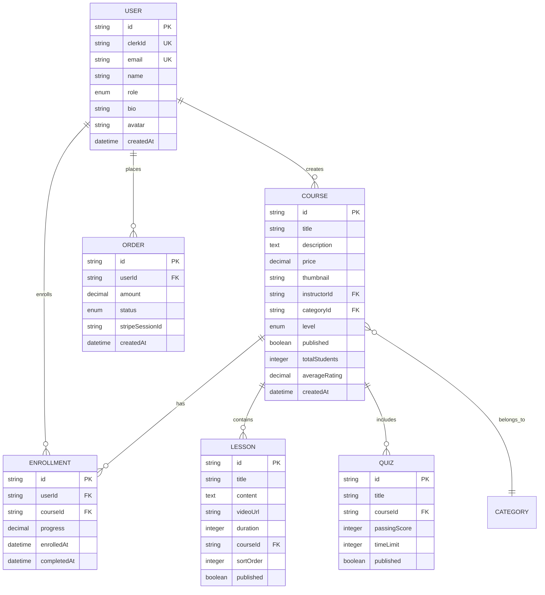

# Database Schema & Data Architecture

The BrainiX platform uses a sophisticated PostgreSQL database with 24 primary models designed to support complex learning workflows, e-commerce operations, and real-time analytics.

## 🗄️ Schema Overview



## 📋 Core Models

### User Management

```prisma
model User {
  id        String   @id @default(cuid())
  clerkId   String   @unique
  email     String   @unique
  name      String?
  role      Role     @default(STUDENT)
  bio       String?
  website   String?
  avatar    String?

  // Relationships
  enrollments     Enrollment[]
  coursesCreated  Course[]
  orders          Order[]
  reviews         Review[]

  createdAt DateTime @default(now())
  updatedAt DateTime @updatedAt
}

enum Role {
  STUDENT
  INSTRUCTOR
  ADMIN
}
```

### Course Structure

```prisma
model Course {
  id          String  @id @default(cuid())
  title       String
  description String?
  price       Decimal?
  thumbnail   String?

  instructorId String
  instructor   User   @relation(fields: [instructorId], references: [id])

  categoryId String
  category   Category @relation(fields: [categoryId], references: [id])

  level       Level    @default(BEGINNER)
  published   Boolean  @default(false)
  featured    Boolean  @default(false)

  // Analytics
  totalStudents   Int     @default(0)
  averageRating   Decimal @default(0)

  // Relationships
  enrollments Enrollment[]
  lessons     Lesson[]
  quizzes     Quiz[]
  reviews     Review[]

  createdAt DateTime @default(now())
  updatedAt DateTime @updatedAt
}

model Lesson {
  id       String @id @default(cuid())
  title    String
  content  String?
  videoUrl String?
  duration Int?

  courseId  String
  course    Course @relation(fields: [courseId], references: [id])

  sortOrder Int
  published Boolean @default(false)

  // Progress tracking
  completions LessonCompletion[]

  createdAt DateTime @default(now())
  updatedAt DateTime @updatedAt
}
```

### Learning Progress

```prisma
model Enrollment {
  id       String @id @default(cuid())
  userId   String
  courseId String

  user   User   @relation(fields: [userId], references: [id])
  course Course @relation(fields: [courseId], references: [id])

  progress    Decimal  @default(0)
  enrolledAt  DateTime @default(now())
  completedAt DateTime?

  // Progress tracking
  lessonCompletions LessonCompletion[]
  quizResults       QuizResult[]

  @@unique([userId, courseId])
}

model LessonCompletion {
  id String @id @default(cuid())

  userId     String
  lessonId   String
  enrollmentId String

  lesson     Lesson     @relation(fields: [lessonId], references: [id])
  enrollment Enrollment @relation(fields: [enrollmentId], references: [id])

  completedAt DateTime @default(now())

  @@unique([userId, lessonId])
}
```

### Assessment System

```prisma
model Quiz {
  id          String @id @default(cuid())
  title       String
  description String?

  courseId String
  course   Course @relation(fields: [courseId], references: [id])

  passingScore Int     @default(70)
  timeLimit    Int?
  published    Boolean @default(false)

  questions QuizQuestion[]
  results   QuizResult[]

  createdAt DateTime @default(now())
  updatedAt DateTime @updatedAt
}

model QuizQuestion {
  id       String @id @default(cuid())
  question String
  options  Json
  answer   String

  quizId String
  quiz   Quiz   @relation(fields: [quizId], references: [id])

  sortOrder Int
}
```

### E-commerce Integration

```prisma
model Order {
  id     String @id @default(cuid())
  userId String
  user   User   @relation(fields: [userId], references: [id])

  amount           Decimal
  status           OrderStatus @default(PENDING)
  stripeSessionId  String?

  items OrderItem[]

  createdAt DateTime @default(now())
  updatedAt DateTime @updatedAt
}

model OrderItem {
  id String @id @default(cuid())

  orderId  String
  courseId String

  order  Order  @relation(fields: [orderId], references: [id])
  course Course @relation(fields: [courseId], references: [id])

  price Decimal
}

enum OrderStatus {
  PENDING
  COMPLETED
  FAILED
  REFUNDED
}
```

## 🔗 Key Relationships

### User-Course Relationships

- **One-to-Many**: User → Courses Created (Instructor)
- **Many-to-Many**: User ↔ Courses (via Enrollments)
- **One-to-Many**: User → Orders

### Content Hierarchy

- **One-to-Many**: Course → Lessons
- **One-to-Many**: Course → Quizzes
- **One-to-Many**: Quiz → Questions

### Progress Tracking

- **One-to-Many**: Enrollment → Lesson Completions
- **One-to-Many**: Enrollment → Quiz Results

## 📊 Database Optimization

### Indexing Strategy

```sql
-- Performance indexes
CREATE INDEX idx_user_email ON "User"(email);
CREATE INDEX idx_course_instructor ON "Course"(instructorId);
CREATE INDEX idx_enrollment_user_course ON "Enrollment"(userId, courseId);
CREATE INDEX idx_lesson_course_order ON "Lesson"(courseId, sortOrder);
```

### Query Optimization

```typescript
// Optimized enrollment query with relations
const enrollment = await prisma.enrollment.findUnique({
  where: { userId_courseId: { userId, courseId } },
  include: {
    course: {
      include: {
        lessons: { orderBy: { sortOrder: "asc" } },
        instructor: { select: { name: true, avatar: true } },
      },
    },
    lessonCompletions: true,
  },
});
```

## 🛡️ Data Security

### Access Control

- Row-level security via Prisma middleware
- User role-based data filtering
- Secure API endpoints with authentication

### Data Validation

```typescript
const courseSchema = z.object({
  title: z.string().min(1).max(100),
  price: z.number().positive().optional(),
  level: z.enum(["BEGINNER", "INTERMEDIATE", "ADVANCED"]),
});
```

This database design supports the full learning platform functionality while maintaining performance, security, and scalability.
