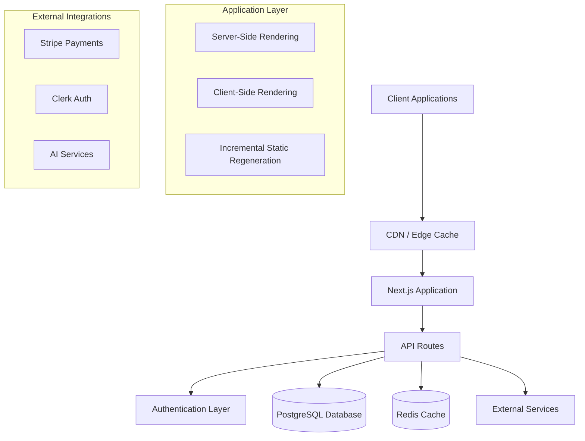
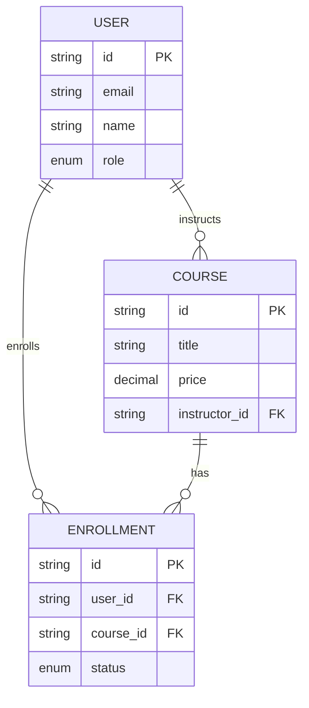
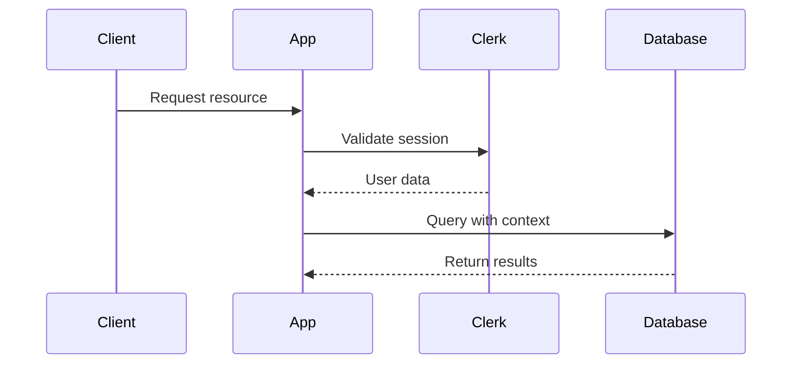

# System Architecture Overview

The BrainiX Learning Platform follows a modern **full-stack architecture** built on Next.js 14 with a focus on scalability, security, and performance.

## 🏗️ High-Level Architecture



## 🎯 Architectural Principles

### 1. **Separation of Concerns**

- **Frontend**: React components with clear responsibilities
- **Backend**: API routes with business logic separation
- **Database**: Normalized schema with proper relationships
- **External Services**: Abstracted integrations with fallback mechanisms

### 2. **Scalability by Design**

- **Horizontal Scaling**: Stateless application design
- **Caching Strategy**: Multi-layer caching (CDN, Redis, Application)
- **Database Optimization**: Efficient queries and indexing
- **Microservices Ready**: Modular architecture for future extraction

### 3. **Security First**

- **Authentication**: Multi-factor authentication with Clerk
- **Authorization**: Role-based access control (RBAC)
- **Data Protection**: Input validation and sanitization
- **API Security**: Rate limiting and request validation

### 4. **Performance Optimization**

- **Code Splitting**: Dynamic imports and lazy loading
- **Image Optimization**: Next.js Image component with WebP/AVIF
- **Bundle Optimization**: Tree shaking and dead code elimination
- **Server-Side Rendering**: SEO and performance benefits

## 🔧 Core Architecture Patterns

### Model-View-Controller (MVC) Variant

```typescript
// Model Layer - Core Data Structure
interface Course {
  id: string;
  title: string;
  instructor: User;
  modules: Module[];
}

// View Layer - React Component
const CourseCard: React.FC<{ course: Course }> = ({ course }) => (
  <Card>
    <CardHeader>{course.title}</CardHeader>
    <CardContent>{course.description}</CardContent>
  </Card>
);

// Controller Layer - API Route
export async function GET() {
  const courses = await courseService.getAllCourses();
  return NextResponse.json(courses);
}
```

### Repository Pattern for Data Access

```typescript
// Core Repository Interface
interface CourseRepository {
  findById(id: string): Promise<Course | null>;
  create(data: CreateCourseData): Promise<Course>;
  update(id: string, data: UpdateCourseData): Promise<Course>;
}

// Implementation
class PrismaCourseRepository implements CourseRepository {
  async findById(id: string): Promise<Course | null> {
    return await prisma.course.findUnique({ where: { id } });
  }
}
```

### Service Layer Pattern

```typescript
// Core Business Logic
class CourseService {
  constructor(private courseRepo: CourseRepository) {}

  async enrollUserInCourse(
    userId: string,
    courseId: string
  ): Promise<Enrollment> {
    const course = await this.courseRepo.findById(courseId);
    if (!course) throw new Error("Course not found");

    return await this.enrollmentRepo.create({ userId, courseId });
  }
}
```

## 🌐 API Architecture

### Core API Structure

```
/api/
├── auth/           # Authentication
├── courses/        # Course management
├── users/          # User management
├── payments/       # Payment processing
└── admin/          # Admin endpoints
```

### Middleware Pipeline

```typescript
// Core Middleware Stack
const middleware = [
  corsMiddleware,
  authMiddleware,
  validationMiddleware,
  errorHandlerMiddleware,
];

// Middleware composition
export function withMiddleware(handler: ApiHandler) {
  return middleware.reduce((acc, mw) => mw(acc), handler);
}
```

## 💾 Database Design

### Core Entity Relationships



## 🔐 Security Architecture

### Authentication Flow



### Authorization Model

```typescript
// Role-based permissions
enum Permission {
  READ_COURSE = "read:course",
  WRITE_COURSE = "write:course",
  DELETE_COURSE = "delete:course",
  MANAGE_USERS = "manage:users",
}

const rolePermissions: Record<UserRole, Permission[]> = {
  STUDENT: [Permission.READ_COURSE],
  INSTRUCTOR: [Permission.READ_COURSE, Permission.WRITE_COURSE],
  ADMIN: Object.values(Permission),
};
```

## 🚀 Deployment Architecture

### Production Environment

- **Frontend**: Vercel Edge Network
- **Backend**: Next.js API Routes
- **Database**: PostgreSQL (Supabase)
- **Authentication**: Clerk
- **Payments**: Stripe

### Performance Optimizations

- Server-side rendering (SSR)
- Static site generation (SSG)
- Image optimization
- Code splitting
- Caching strategies

---

_This architecture ensures scalability, security, and maintainability for the BrainiX learning platform._
