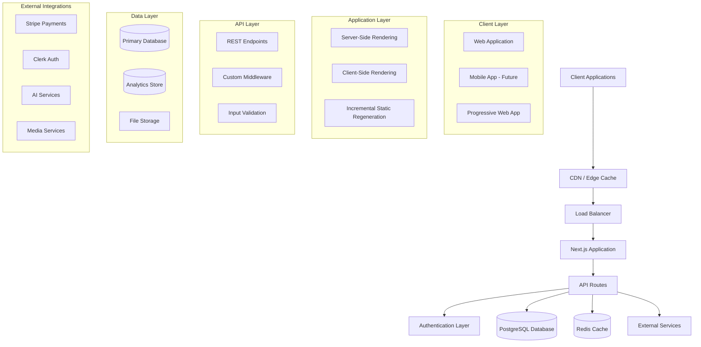
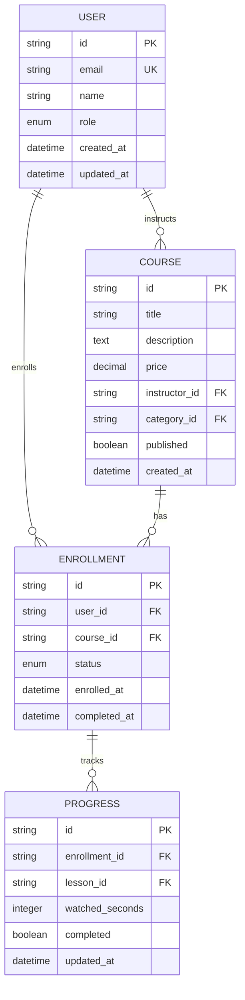
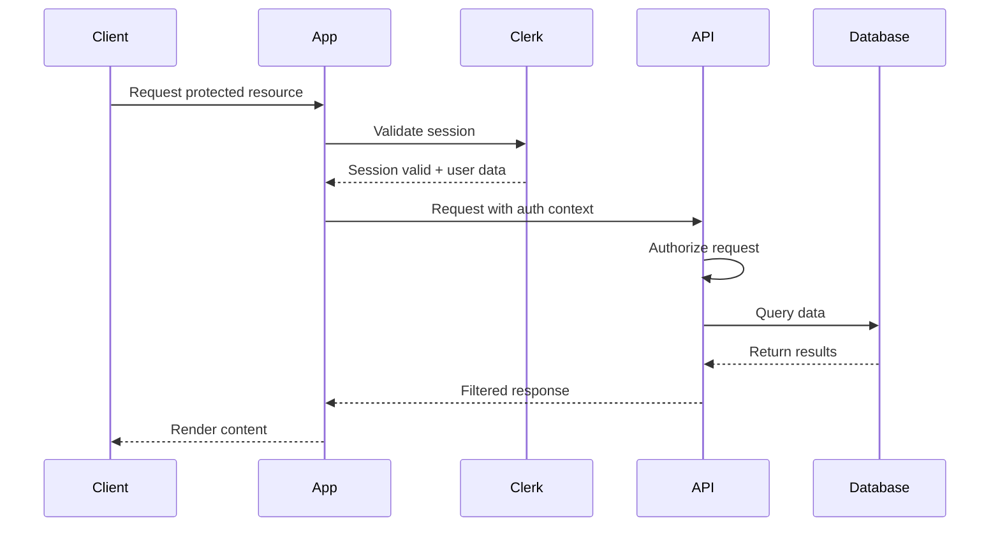
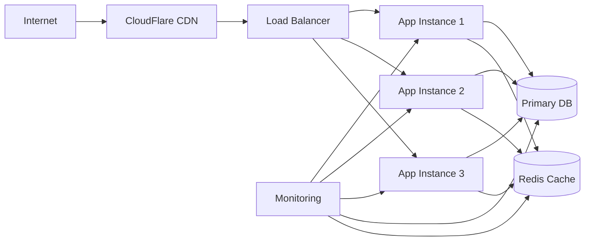

# System Architecture Overview

The BrainiX Learning Platform follows a modern **full-stack architecture** built on Next.js 14 with a focus on scalability, security, and performance. This document provides a comprehensive overview of the system's architectural design and core patterns.

## 🏗️ High-Level Architecture



## 🎯 Architectural Principles

### 1. **Separation of Concerns**
- **Frontend**: React components with clear responsibilities
- **Backend**: API routes with business logic separation
- **Database**: Normalized schema with proper relationships
- **External Services**: Abstracted integrations with fallback mechanisms

### 2. **Scalability by Design**
- **Horizontal Scaling**: Stateless application design
- **Caching Strategy**: Multi-layer caching (CDN, Redis, Application)
- **Database Optimization**: Efficient queries and indexing
- **Microservices Ready**: Modular architecture for future extraction

### 3. **Security First**
- **Authentication**: Multi-factor authentication with Clerk
- **Authorization**: Role-based access control (RBAC)
- **Data Protection**: Input validation and sanitization
- **API Security**: Rate limiting and request validation

### 4. **Performance Optimization**
- **Code Splitting**: Dynamic imports and lazy loading
- **Image Optimization**: Next.js Image component with WebP/AVIF
- **Bundle Optimization**: Tree shaking and dead code elimination
- **Server-Side Rendering**: SEO and performance benefits

## 🔧 Core Architecture Patterns

### Model-View-Controller (MVC) Variant

```typescript
// Model Layer - Data and Business Logic
interface Course {
  id: string;
  title: string;
  instructor: User;
  modules: Module[];
  // ... other properties
}

// View Layer - React Components
const CourseCard: React.FC<{ course: Course }> = ({ course }) => {
  return (
    <Card>
      <CardHeader>{course.title}</CardHeader>
      <CardContent>{course.description}</CardContent>
    </Card>
  );
};

// Controller Layer - API Routes and Hooks
export async function GET(request: Request) {
  const courses = await courseService.getAllCourses();
  return NextResponse.json(courses);
}
```

### Repository Pattern for Data Access

```typescript
// Abstract repository interface
interface CourseRepository {
  findById(id: string): Promise<Course | null>;
  findMany(filters: CourseFilters): Promise<Course[]>;
  create(data: CreateCourseData): Promise<Course>;
  update(id: string, data: UpdateCourseData): Promise<Course>;
  delete(id: string): Promise<void>;
}

// Prisma implementation
class PrismaCourseRepository implements CourseRepository {
  async findById(id: string): Promise<Course | null> {
    return await prisma.course.findUnique({
      where: { id },
      include: { instructor: true, modules: true }
    });
  }
  
  // ... other implementations
}
```

### Service Layer Pattern

```typescript
// Business logic encapsulation
class CourseService {
  constructor(
    private courseRepo: CourseRepository,
    private enrollmentRepo: EnrollmentRepository,
    private paymentService: PaymentService
  ) {}

  async enrollUserInCourse(userId: string, courseId: string): Promise<Enrollment> {
    // Business logic validation
    const course = await this.courseRepo.findById(courseId);
    if (!course) throw new Error('Course not found');
    
    const existingEnrollment = await this.enrollmentRepo.findByUserAndCourse(userId, courseId);
    if (existingEnrollment) throw new Error('User already enrolled');
    
    // Process enrollment
    return await this.enrollmentRepo.create({ userId, courseId });
  }
}
```

## 🌐 API Architecture

### RESTful Design Principles

```
/api/
├── auth/                    # Authentication endpoints
│   ├── signin              # POST - User sign in
│   ├── signout             # POST - User sign out
│   └── refresh             # POST - Token refresh
├── courses/                # Course management
│   ├── GET /               # List courses
│   ├── POST /              # Create course
│   ├── GET /:id            # Get course details
│   ├── PUT /:id            # Update course
│   ├── DELETE /:id         # Delete course
│   └── /:id/enroll         # POST - Enroll in course
├── users/                  # User management
├── payments/               # Payment processing
└── admin/                  # Administrative endpoints
```

### Middleware Architecture

```typescript
// Request processing pipeline
const middleware = [
  corsMiddleware,           // CORS handling
  rateLimitMiddleware,      // Rate limiting
  authenticationMiddleware, // User authentication
  authorizationMiddleware,  // Permission checking
  validationMiddleware,     // Input validation
  loggingMiddleware,        // Request logging
  errorHandlingMiddleware   // Error handling
];

// Middleware composition
export function withMiddleware(handler: ApiHandler) {
  return middleware.reduce((acc, mw) => mw(acc), handler);
}
```

## 💾 Data Architecture

### Database Design Philosophy



### Caching Strategy

```typescript
// Multi-layer caching implementation
class CacheStrategy {
  // L1: Application Memory Cache (fastest)
  private memoryCache = new Map<string, any>();
  
  // L2: Redis Cache (fast, shared)
  private redisCache: Redis;
  
  // L3: Database (slowest, authoritative)
  private database: PrismaClient;
  
  async get(key: string): Promise<any> {
    // Try memory cache first
    if (this.memoryCache.has(key)) {
      return this.memoryCache.get(key);
    }
    
    // Try Redis cache
    const cached = await this.redisCache.get(key);
    if (cached) {
      const data = JSON.parse(cached);
      this.memoryCache.set(key, data);
      return data;
    }
    
    // Fallback to database
    const data = await this.fetchFromDatabase(key);
    if (data) {
      await this.redisCache.setex(key, 3600, JSON.stringify(data));
      this.memoryCache.set(key, data);
    }
    
    return data;
  }
}
```

## 🔐 Security Architecture

### Authentication Flow



### Authorization Model

```typescript
// Role-based permissions
enum Permission {
  READ_COURSE = 'read:course',
  WRITE_COURSE = 'write:course',
  DELETE_COURSE = 'delete:course',
  MANAGE_USERS = 'manage:users',
  VIEW_ANALYTICS = 'view:analytics'
}

const rolePermissions: Record<UserRole, Permission[]> = {
  STUDENT: [Permission.READ_COURSE],
  INSTRUCTOR: [
    Permission.READ_COURSE,
    Permission.WRITE_COURSE,
    Permission.VIEW_ANALYTICS
  ],
  ADMIN: Object.values(Permission)
};

// Permission checking middleware
export function requirePermission(permission: Permission) {
  return async (req: NextRequest) => {
    const user = await getAuthenticatedUser(req);
    const userPermissions = rolePermissions[user.role];
    
    if (!userPermissions.includes(permission)) {
      return NextResponse.json({ error: 'Forbidden' }, { status: 403 });
    }
    
    return NextResponse.next();
  };
}
```

## ⚡ Performance Architecture

### Optimization Strategies

```typescript
// Performance optimization configuration
const performanceConfig = {
  // Frontend optimizations
  frontend: {
    codesplitting: true,
    lazyLoading: true,
    imageOptimization: {
      formats: ['webp', 'avif'],
      sizes: [640, 750, 828, 1080, 1200, 1920],
      quality: 85
    },
    bundleAnalysis: true
  },
  
  // Backend optimizations
  backend: {
    connectionPooling: {
      min: 5,
      max: 20,
      idleTimeout: 30000
    },
    queryOptimization: true,
    responseCompression: true,
    rateLimiting: {
      windowMs: 15 * 60 * 1000, // 15 minutes
      max: 100 // requests per window
    }
  },
  
  // Caching configuration
  caching: {
    redis: {
      ttl: 3600, // 1 hour
      maxmemory: '256mb'
    },
    cdn: {
      cacheTtl: 86400, // 24 hours
      browserCache: 'public, max-age=31536000'
    }
  }
};
```

## 🚀 Deployment Architecture

### Infrastructure Overview



### Scalability Considerations

1. **Horizontal Scaling**
   - Stateless application instances
   - Load balancer distribution
   - Database read replicas

2. **Vertical Scaling**
   - Resource optimization
   - Performance monitoring
   - Capacity planning

3. **Future Microservices**
   - Service extraction strategy
   - API gateway implementation
   - Inter-service communication

---

This architecture overview provides the foundation for understanding the BrainiX platform's design. Each component is detailed further in the respective documentation sections.

:::tip Next Steps
- Explore the [Technology Stack](./technology-stack) for detailed technology choices
- Review the [Database Schema](./database-schema) for data model details
- Check the [API Design](./api-design) for endpoint specifications
:::
