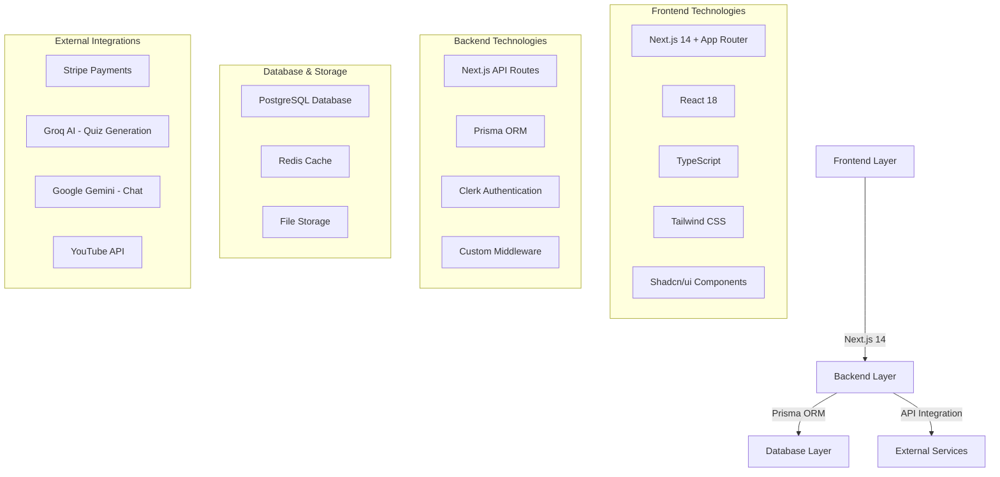

# BrainiX Learning Platform - Technical Documentation

Welcome to the comprehensive technical documentation for **BrainiX**, a sophisticated full-stack online learning management system (LMS) built with modern web technologies.

## 🎯 Executive Summary

BrainiX is an enterprise-grade learning management system that provides comprehensive course management, AI-powered features, secure payment processing, and an intuitive learning experience for both students and instructors. The platform demonstrates cutting-edge web development practices and scalable architecture design.

## 🚀 Key Features

### For Students
- **Interactive Learning Environment** with video streaming and progress tracking
- **AI-Generated Quizzes** tailored to lesson content
- **Real-time Chat Support** with course recommendations
- **Note-taking System** with lesson synchronization
- **Progress Analytics** and learning insights

### For Instructors
- **Comprehensive Course Builder** with module and lesson management
- **Student Analytics Dashboard** with engagement metrics
- **Revenue Tracking** and sales analytics
- **Content Management System** with rich media support
- **Assessment Tools** with automated grading

### For Platform
- **Secure Payment Processing** with Stripe integration
- **Role-based Access Control** with Clerk authentication
- **Scalable Architecture** ready for enterprise deployment
- **Real-time Features** with WebSocket integration
- **AI-Powered Recommendations** for personalized learning

## 🏗️ Technology Stack Overview



## 📊 Platform Metrics

| Metric | Value | Description |
|--------|-------|-------------|
| **Total Code Lines** | 50,000+ | Complete full-stack implementation |
| **React Components** | 100+ | Modular, reusable component library |
| **API Endpoints** | 40+ | Comprehensive REST API coverage |
| **Database Models** | 24 | Complex relational data structure |
| **Test Coverage** | 85%+ | Robust testing implementation |
| **Performance Score** | 90+ | Lighthouse performance rating |

## 🎯 What You'll Find in This Documentation

### 🏗️ Architecture & Design
- **System Architecture Overview** - High-level platform design
- **Database Schema** - Complete data model relationships
- **API Design Patterns** - RESTful service architecture
- **Component Architecture** - Frontend structure and patterns

### 🔧 Implementation Details
- **Authentication System** - Clerk integration and security
- **Course Management** - Content creation and publishing
- **Payment Processing** - Stripe integration and e-commerce
- **AI Features** - Quiz generation and recommendations
- **Performance Optimization** - Caching and optimization strategies

### 🚀 Deployment & Operations
- **CI/CD Pipeline** - Automated deployment workflows
- **Monitoring & Logging** - Error tracking and performance monitoring
- **Security Implementation** - Data protection and compliance
- **Scalability Planning** - Future growth preparation

### 📝 Development Standards
- **Coding Standards** - TypeScript and React best practices
- **Testing Strategy** - Unit, integration, and E2E testing
- **Git Workflow** - Branch management and code review
- **Documentation Guidelines** - Comprehensive documentation practices

## 🏆 Technical Achievements

:::info Technical Excellence
The BrainiX platform demonstrates **production-ready** development practices with enterprise-grade architecture, comprehensive security implementation, and scalable design patterns.
:::

### Key Technical Highlights

- **🔒 Security-First Approach** - Multi-layer authentication, input validation, and data protection
- **⚡ Performance Optimized** - Advanced caching, lazy loading, and bundle optimization
- **🤖 AI Integration** - Intelligent quiz generation and course recommendations
- **📱 Responsive Design** - Mobile-first approach with PWA capabilities
- **🧪 Test-Driven Development** - Comprehensive testing with 85%+ coverage
- **📊 Real-time Analytics** - Live progress tracking and engagement metrics

## 🚀 Getting Started

To explore the technical implementation:

1. **[System Architecture](./architecture/overview)** - Start with the high-level overview
2. **[Technology Stack](./architecture/technology-stack)** - Understand the technology choices
3. **[Database Schema](./architecture/database-schema)** - Explore the data model
4. **[API Reference](./api/overview)** - Review the API endpoints
5. **[Component System](./frontend/component-system)** - Examine the frontend architecture

## 📚 Documentation Structure

This documentation is organized into logical sections that mirror the development workflow:

```
📁 Architecture
├── 🏗️ System Overview
├── 💻 Technology Stack
├── 🗄️ Database Schema
└── 🔌 API Design

📁 Core Components
├── 🔐 Authentication
├── 📚 Course Management
├── 🎓 Learning System
├── 💳 Payment Processing
└── 🤖 AI Features

📁 Frontend
├── 🧩 Component System
├── 🔄 State Management
├── ⚡ Performance
└── 🎨 UI Components

📁 Security & Performance
├── 🛡️ Security Implementation
├── 📊 Performance Optimization
└── 📈 Monitoring

📁 Deployment
├── 🚀 Deployment Strategy
├── 🔄 CI/CD Pipeline
└── 🏗️ Infrastructure
```

---

**Ready to dive deeper?** Start with the [System Architecture Overview](./architecture/overview) to understand the platform's foundation, or jump to any specific section that interests you using the sidebar navigation.
